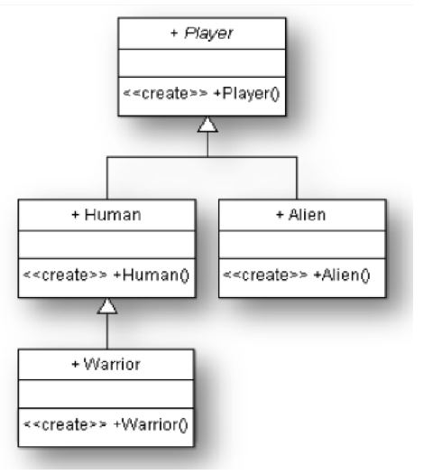
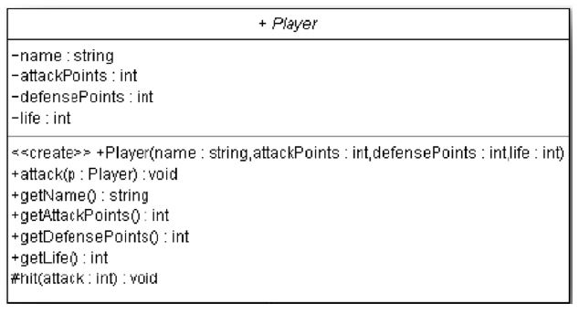
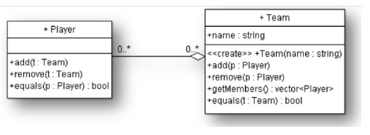
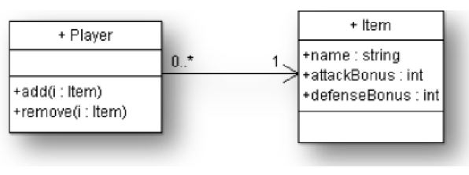
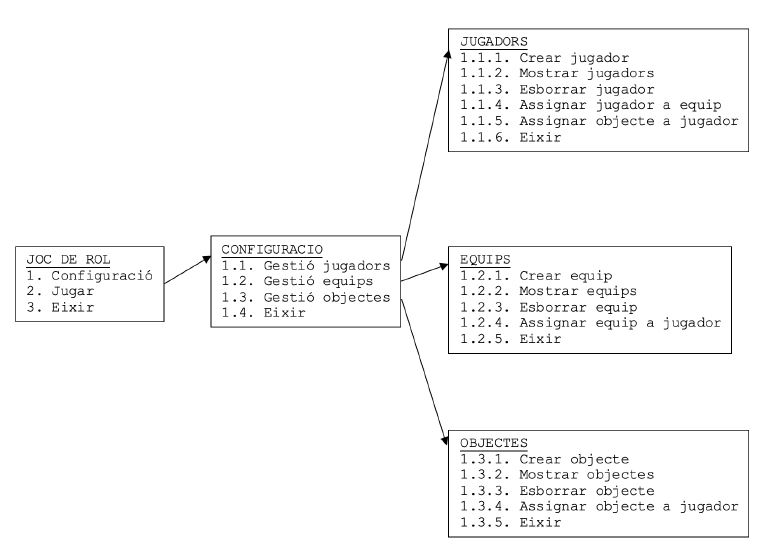

# Joc de Rol.

## Explicación de la Práctica


## Contenidos

- Generalidades
- Fase 1. Herencia
   - Explicación
   - Tareas a efectuar:
- Fase 2. Dando cuerpo a los jugadores
   - Explicación
   - Se pide
- Fase 3. Sobrecarga y Polimorfismo
   - Explicación
   - Se pide
- Fase 4. Relaciones entre clases
   - Explicación
   - Se pide
- Fase 5. Más relaciones
   - Explicación
   - Se pide
- Fase 6. Configuración del programa principal y Excepciones
   - Explicación
   - Se pide
      - Configuración
      - Jugar
      - Excepciones


## Generalidades

En esta práctica vamos a realizarla durante 3 entregas, de manera que iremos añadiendo funcionalidades a
la misms. Para eso haremos un poquito y acabaremos, haremos otro poquito más y pararemos, y así hasta
completar las 7 fases que consta la totalidad de la práctica.

Para desarrollarlo y no perder nada lo podremos hacer de dos maneras:

```
1. 7 proyectos distintos en 7 carpetas distintas. Cuando acabemos la primero copiaremos y pegaremos
esta copia haremos la segunda. De esta manera cuando acabemos las fases n es el inicio de la fase
n+1
```
2. Haciendo servir **GIT**. De manera que nos ponemos a programar. Cuando acabemos cada fase haremos
    un commit dandole como a nombre la fase en la que estemos. Eso nos permitirá volver a cada una 
    de las fases anteriores.


## Fase 1. Herencia

### Explicación

Queremos programar un juego de rol donde se van a crear diversos jugadores. Estos jugadores los
llamaremos de manera genérica Player. Al momento de jugar, es podrá elegir entre 3 tipos diferentes
de jugadores: humano (Human), guerrero (Warrior) o alienígena (Alien). Cada personaje tiene unas
características propias, que són: los puntos de ataque, los puntos de defensa y los puntos de vida
y el comportamiento de cada jugador dependerá de su raza.

El juego consistirá en que los jugadores se ataquen entre ellos. Cada vez que el jugador A ataca al
jugador B, pasan 2 cosas:

- A golpea B
- B golpea A (condicional)

Cuando el jugador A golpea a B se hace la resta entre los puntos de ataque del jugador A y los puntos
de defensa del jugador B. Si el resultado es positivo, el jugador B pierde esta cantidad de puntos
de vida. Si al jugador B aún le quedan puntos de vida (no está muerto) se podrá defender y golpear a A.
Cuando los puntos de vida de un jugador lleguen a cero, diremos que está muerto.

La relación de los diferentes tipos de jugadores se muestra en el siguiente diagrama:



Como podemos ver, un jugador Warrior es una especialización de un jugador Human. Y Alien y Human
són también una especialización de Player. Eso lo podemos conseguir mediante la herencia.

La clase Player será abstracta. Es decir, no podremos crear jugadores (objetos) de esa clase, sinó de
las especialidades, las cuales se diferencian en:

- Human→No tienen bonificaciones en defensa ni en ataque.
- Alien→Tienen bonificaciones en cada ataque pero tambien penalizaciones en defensa.
- Warrior→Pueden aguantar más heridas que el resto de jugadores.

### Tareas a efectuar:

1. Crea la aplicación JocDeRol_V1  con los siguientes paquetes (caso de Java).
    - io: Para las clases de utilidades y de lectura escritura de teclado y pantalla. Puedes
       hacer servir las suministradas a lo largo del curso por el profesor.
    - joc: Para las clases Player, Human, Alien y Warrior.
    - inici: Para la clase JocDeRol, con el programa principal.

```
Nota: en Python puede hacerse todo en el mismo fichero. Ya estudiaremos como separarlo en distintos ficheros.
```
```
2. Implementa en el paquete joc las 4 clases (Player,Human,Warrior,Alien), con las herencias
que le toquen y con los métodos constructores por defecto correspondientes, sin parámetros.
Los constructores, de momento, han de sacar por pantalla el seguiente texto:
```
```
CONSTRUCTOR−> He creado un < nombre_de_la_clase_correspondiente >
```
```
3. En la clase JocDeRol del paquete inici crea la función pruebaFase(), que nos ayudará a entender
como funciona el mecanismo de la herencia. Esa función a de crear un objecto de cada tipo
(Human, Warrior y Alien). Antes de crear cada objeto avisará por pantalla el tipo de objeto
que va a crear. Al ejecutarlo, comprobaremos que cuando se llama al constructor de una clase, se
llama automáticamente (y por orden) a todos los constructores de las clases de la cuales hereda.
```
4. Si has usado GIT, ahora es el momento de hacer el commit rol_v1


## Fase 2. Dando cuerpo a los jugadores

### Explicación

Añadiremos los atributos para guardar los puntos de ataque, defensa y vida, así como los métodos
necesarios para atacar a otro jugador. El diagrama de clases quedará de la maners siguiente:



```
Nota: Esta representación es del diagrama de clases de UML. A la cual, los campos y/o métodos
se han de poner como:
```
- Se pone un - cuando el atributo o método es privado
- Se pone un + cuando el atributo o método es público
- Se pone un # cuando el atributo o método es protected

### Se pide

```
1. Clona el proyecto a JocDeRol_V2, con copia y refactorización (este paso no es necesario si usas git).
```
2. Modifica la clase Player:
    - Añade 4 atributos: name, attackPoints, defensePoints, life
    - Modifica el constructor para pasarle los 4 atributos. Haría falta modificar también los constructores
       de las otras clases heredadas.
    - Añade los 4 métodos getters corresponents per a consultar cada atributo.

```
3. Sobreescribe el método toString()(o__str__) de la clase Object en la clase Player. Devolverá
todos los datos del jugador con el siguiente formato:
```

```
John Smith PA : 1 3 / PD : 8 / PV : 3 9
```
- Añade el método void attack(Player p), que se utiliza cuando un jugador quiere atacar a otro. Cuando
    un jugador A quiere atacar a otro jugador B, se hará la llamada A.attack(B). Este método consiste
    en que B sea golpeado por A (una llamada al método hit() de B) y que, en caso de que B aún esté
    con vida le podrá devolver el golpe, y A sea golpeado por B (una llamada al método hit() de A).
    Antes y después de realizar estas 2 acciones, haría falta mostrar los datos de cada uno de los
    2 jugadores. Por ejemplo:

```
// ANTES DEL ATAQUE :
Atacante: John Smith PA:13 / PD:8 / PV:39
Atacado : Martian PK PA:27 / PD:2 / PV:32
// ATAQUE :
Martian PK es golpeado con 13 puntos y se defiende con 2. Vidas: 32 − 11 = 21
John Smith es golpeado con 27 puntos y se defiende con 8. Vidas: 39 − 19 = 20
// DESPUÉS DEL ATAQUE :
Atacante: John Smith PA:13 / PD:8 / PV:20
Atacado : Martian PK PA:27 / PD:2 / PV:21
```

```
Nota: las líneas de ataque las muestra el método hit en las dos llamadas correspondientes que se hacen
 a este método.
```

- Añade el método void hit( **int** attackPoints). Será **protected** (nada más accesible desde la
    clase y clases heredadas), ya que nada más a de llamarse desde el método attack. Es llamado desde
    el método attack(dos veces) para decir que un jugador es golpeado por otro y tantos puntos de
    ataque. El método a de restar tantos puntos de vida como la diferencia entre los puntos con que 
    le atacan y los puntos de defensa que tiene. Los puntos de vida nunca podrán ser aumentados ni ser
    menores que 0. Mostrará un mensaje diciendo que es atacado, con cuantos puntos lo atacan, con
    cuantos puntos se defiende, cuanta vida tenía, cuantas le quitan y cuantas tendrá finalmente.
4. En la clase JocDeRol del paquete inici modifica la función pruebaFase(), que nos muestre el
funcionamiento de la función de los ataques.
- Esa función a de crear un objeto de cada tipo (Human, Warrior y Alien).
- Hacer algunos ataques entre ellos
- Comprobar en la salida que las puntuaciones están bien realizadas
5. Si estás programandolo en Python, ahora deberias de hacer un nuevo commit con el nombre rol_v2


## Fase 3. Sobrecarga i Polimorfismo

### Explicación

Como hemos dicho antes, las clases heredadas de Player son especializaciones suyas. Es decir: Player
implementa un comportamiento genérico que cada una de las clases heredadas puede modificar. Este cambio
de comportamiento se puede realizar bien añadiendo atributos y métodos propios a la clase heredada o
bien volviendo a codificar algunos de los métodos de la clase heredada.

El polimorfismo consiste en utilizar el mecanismo de redefinición (overriding en inglés). Consiste en
redefinir. Es decir: volver a codificar el comportamiento heredado de acuerdo a las necesidades de
especialización de la clase heredada.

En nuestro caso, queremos volver a codificar los métodos necesarios a cada clase heredada para conseguir
los siguientes comportamientos:

- Los jugadores de tipo Humano no podrán tener más de 100 puntos de vida, por tanto, se a de limitar
    esta característica al momento de su creación.
- Los jugadores de tipo Alien enloquecen cuando ataquen, pero olvidan su defensa. Cuando un Alien
    ataca, si no está gravemente herido (puntos de vida superior a 20) aumentan en 3 sus puntos de
    ataque y disminuyen en 3 sus puntos de defensa. Si están gravemente heridos (puntos de vida 
    iguales o inferiores a 20) se comportan de manara normal.

```
Nota: Los puntos de ataque quedan aumentados también despues del ataque (y también los de la defensa
después de defender), es decir estas modificaciones se mantienen.
```
- Los jugadores de tipo Warrior, debido a su entrenamiento, tienen una gran agilidad. Si el golpe no
    es superior a 5 puntos, este queda reducido a 0. Los golpes (hit) es la diferencia entre el ataque
    que sufre y la defensa del jugador.

### Se pide

1. Clonar el proyecto a JocDeRol_V3 (con copia y refactorización).
2. Codificar las clases Human, Alien y Warrior, sobreescribiendo los métodos necesarios para que
tengan el comportamiento descrito anteriormente.
3. En la clase JocDeRol del paquete inici adapta la función pruebaFase() para comprobar el
funcionamiento. Esa función a de crear, al menos, 3 jugadores de diferente tipo y mostrará sus
propios datos. También a de incluir diversos ataques de unos a otros.
4. Hacer un commit a JocDeRol_V4, si estás usando GIT.


## Fase 4. Relaciones entre clases

### Explicación

Queremos crear equipos de jugadores con la siguiente característica. Cualquier jugador pueda añadirse
a un equipo. Un equipo, por tanto, es un conjunto de jugadores, y cada jugador puede pertenecer a 
más de un equipo.

El diagrama UML que representa esta asociación entre las clases Player y Team és el siguiente:



Es decir: podemos añadir, borrar y listar a los jugadores que pertenezcan a un equipo.

Además implementaremos un nuevo método para la realización de las comparaciones: implementar el 
método equals.

La clase Team también tendrá el método toString(), que servirá para devolver en forma de cadena
a los jugadores que forman el equipo.

Fijaros que, cuando un jugador se añade a un equipo, el equipo se añade al mismo tiempo a la lista
 de equipos del jugador. La relación Team-Player es bidireccional y, por tanto, Player conoce a sus Team
  y Team conoce a sus Player.

### Se pide

1. Clona el proyecto a JocDeRol_V4 (con copia y refactorización).
2. Crea la clase Team en el paquete joc, con el atributo name:
- Crea el constructor, pasandole el nombre del equipo
- Para implementar la relación entre clases definida al diagrama anterior, añade un atributo
privado de tipo ArrayList, denominado players, y los métodos que aparacen al diagrama para
añadir miembros, llevarlos o bién consultarlos. También habría que incluir el método toString()
que devuelva el nombre del equipo y los datos de sus jugadores entre parentesis. Por ejemplo:
'''
Equip Els Guais:
John Smith PA:13 / PD:8 / PV:39 (perteneca a 2 equipos)
Geronimo PA:9 / PD:4 / PV:100 (pertenece a 1 equipo)
'''

- Añadir el método equals. El criterio de igualdad es el contenido de todo el objeto.
3. Modifica la clase Player:
- Por tal que puedan añadirse los equipos de un jugador habría que añadir un atributo privado de
tipo ArrayList, denominado teams, y los métodos correspondientes (para añadir un jugador a un
grupo o para quitarlo). Ten encuenta que si asignas un jugador a un grupo automaticamente se ha
de asignar también el grupo al jugador, y viceversa (ten en cuenta: no proboques recursión infinita).
También para quitar un jugador de un grupo.
- El método toString() se habría de modificar para devolver entre parentesis la cantidad de equipos
a los cuales pertenece el jugador. Por ejemplo:
John Smith PA:13 / PD:8 / PV:39 ( pertenece a 2 equipos )
- Añade el método equals. El criterio de igualdad es el nombre del jugador y los puntos de ataque
y defensa y la vida.
4. En la clase JocDeRol del paquete inici adapta la función pruebaFase() para comprobar el
funcionamiento de las últimas modificaciones hechas. Esa función a de crear algunos jugadores
y equipos.
También a de asisgnar jugadores a equipos, desasignarlos, etc. También a de comprobar la igualdad
entre algunos Team y Player.


## Fase 5. Más relaciones

### Explicación

Por tal de añadir interés, queremos implementar en nuestro juego la posibilidad que los jugadores
lleven armas o escudos que modifiquen su capacidad de ataque y de defensa. Cada jugador puede
llevar multiples armas o escudos que modifiquen su capacidad de ataque y de defensa. Cada jugador
puede llevar multiples armas, pero cada arma pertenece a un unico jugador. A dichas armas y 
escudos las nombraremos Item

- Cada arma tiene un nombre, un bonus de ataque y un bonus de defensa. Cuando un jugador se
    disponga a atacar, lo hará con la suma de sus puntos de ataque habituales más la suma de todos
    los bonus de ataque de sus armas.
- De la misma manera, cuando un jugador se disponga a defender, lo hará con la suma de sus puntos
    de defensa habitual más la suma de los bonus de defensa de todas sus armas.
- Los bonus de ataque y de defensa pueden ser negativos y, por tanto, penalizar al jugador.
- Las características individuales de cada tipo de jugador (Human, Alien y Warrior) no se
    modifican, sinó que se dejan igual que estaban.



### Se pide

1. Clona el proyecto a JocDeRol_V5 (con copia y refactorización).
2. Crea la clase Item en el paquete joc, con los 3 atributos corresponentes y un constructor al
cual le pases los 3 parámetros.
3. Haz los cambios necesarios a la clase Player para implementar el funcionamiento anterior.
Es decir:
- Crea un vector de ítems denominado items.
- Implementa los métodos add y remove para añadir y quitar un item a un jugador.
- A la hora de atacar o defenderse, aumenta los puntos de ataque o de defensa con la suma de
los puntos items de un jugador.
4. El método toString() se habría de modificar para devolver los nombres de sus items con los
respectivos bonus. Por ejemplo:


```
John Smith PA:10 / PD:19 / PV:39 ( pertenece a 1 equipo ) tiene los items:
− Sunglasses BA:−1 / BD:−1
− False Nails BA:5 / BD:2
```
5. En la clase JocDeRol del paquete inici adapta la función pruebaFase() para comprobar el
funcionamiento.


## Fase 6. Configuración del programa principal y Excepciones

### Explicación

En el programa principal (en la clase JocDeRol del paquete inici) definiremos un ArrayList para guardar
los jugadores, otro para los grupos y otro para las armas. Lo que queremos hacer es toda la
 configuración de dar de alta los jugadores, items y equipos.



### Se pide

1. Clona el proyecto a JocDeRol_V6 (con copia y refactorización) e implementar:

#### Configuración

En esta opción crearemos todos los objetos de la aplicación. Por ejemplo, la opción de crear
jugador (1.1.1) podría hacer lo siguiente:

1. Preguntar el tipo de jugador (A, W, P), el nombre y los puntos de ataque (entre 1 i 100)


```
2. Asignar los puntos de defensa (PA + PD = 100) y los puntos de vida iniciales. Este valor será
 igual para todos los jugadores. Por tanto, habría de ir como a static en la clase correspondiente
 y es podría modificar en el apartado de configuración. Por defecto, 100.
3. Crear el jugador y ponerlo en el ArrayList de jugadores, comprobando previamente que no existia
ja un jugador igual. 2 jugadores seran iguales si tienen el mismo nombre. Habría que implementar
 el método equals de la clase Player.
```
#### Jugar

Bucle donde le toque el turno cada vez a un jugador del ArrayList de jugadores. Este elegirá a
que jugador quiere atacar de manera aleatoria entre todos los otros. Así hasta que nada más
quede un jugador vivo, que sería el ganador.

Echale imaginación y crea tus propias normas!

#### Excepciones

Crear y lanzar (y capturar) las siguientes situaciones anómalas al largo del juego:

Exercicio: Crea las seguientes excepciones al proyecto

1. Un jugador muerto no puede atacar ni ser atacado
2. Un jugador no puede atacarse el mismo.
3. No podemos quitar de un equipo a un jugador que no le pertenece.
4. Un equip no puede tener jugadores repetidos y viceversa.

